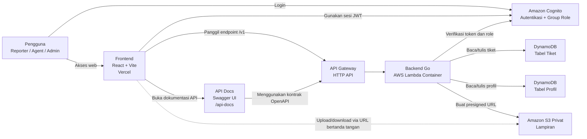
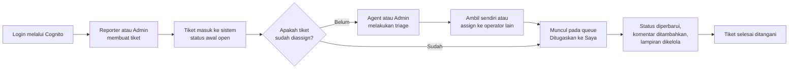
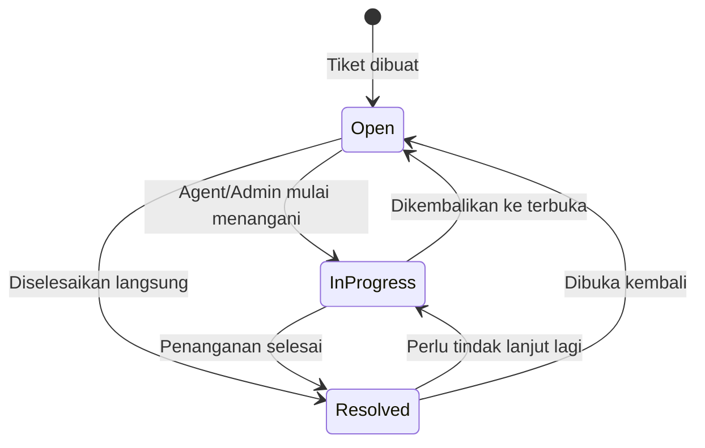
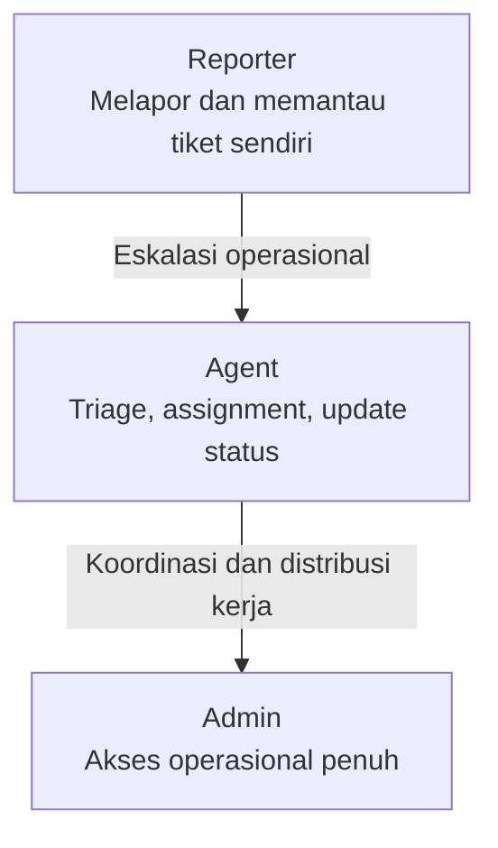
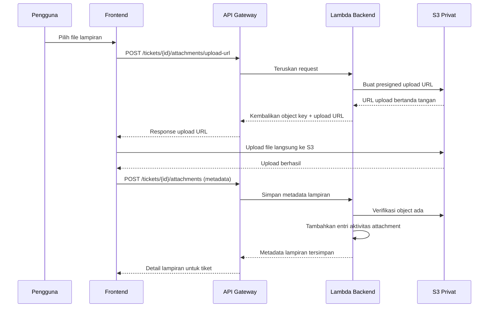
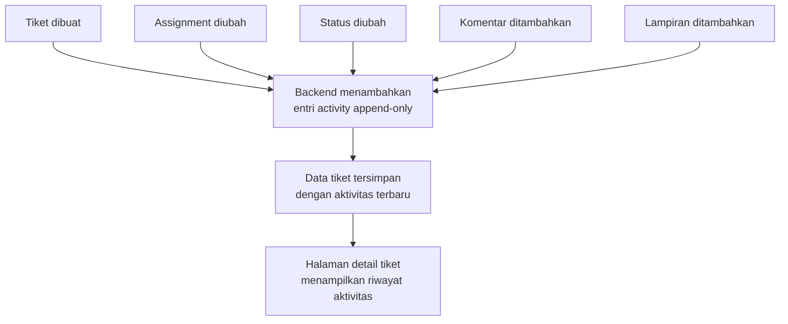

# OpsDesk Diagram Pack

Dokumen ini mengumpulkan diagram visual utama OpsDesk dalam format Mermaid agar mudah dibaca di GitHub, mudah dirawat di repository, dan tetap selaras dengan implementasi saat ini.

## Tujuan

Diagram-diagram di bawah ini dirancang untuk membantu dosen, reviewer, recruiter, dan anggota tim memahami OpsDesk secara cepat dari sisi:

- arsitektur sistem
- alur pengguna
- lifecycle tiket
- RBAC
- alur upload lampiran yang aman
- audit trail dan histori aktivitas

## 1. Diagram Arsitektur Sistem

Diagram ini menunjukkan komponen utama yang memang aktif pada implementasi saat ini.

## 2. Diagram User Flow

Diagram ini menunjukkan alur produk dari sudut pandang penggunaan utama. Bagian pentingnya adalah: membuat tiket tidak otomatis berarti tiket langsung diassign.

## 3. Diagram Ticket Lifecycle

Lifecycle saat ini masih sederhana dan jujur terhadap implementasi yang ada. Status yang benar-benar dipakai sekarang adalah:

- `open`
- `in_progress`
- `resolved`

Catatan:

- assignment bukan status terpisah, melainkan atribut tanggung jawab pada tiket
- komentar, lampiran, dan histori aktivitas dapat terjadi pada berbagai tahap status

### Pengembangan Lanjutan

Bagian ini belum diimplementasikan dan hanya termasuk roadmap:

- status seperti `pending`, `on_hold`, atau `closed`
- aturan SLA dan eskalasi otomatis

## 4. Visual RBAC

### Diagram peran singkat

### Matriks hak akses

| Aktivitas | Reporter | Agent | Admin |
| --- | --- | --- | --- |
| Login ke aplikasi | Ya | Ya | Ya |
| Membuat tiket | Ya | Tidak | Ya |
| Melihat tiket sendiri | Ya | Ya | Ya |
| Melihat dashboard dan daftar tiket operasional | Tidak | Ya | Ya |
| Menambahkan komentar pada tiket yang dapat diakses | Ya | Ya | Ya |
| Mengubah status tiket | Tidak | Ya | Ya |
| Mengambil assignment untuk diri sendiri | Tidak | Ya | Ya |
| Menugaskan tiket ke operator lain yang eligible | Tidak | Ya | Ya |
| Melihat queue `Ditugaskan ke Saya` | Tidak | Ya | Ya |
| Memantau antrean operasional lintas tiket | Tidak | Ya | Ya |

Penjelasan praktis:

- `Reporter` fokus pada pencatatan masalah dan pemantauan tiket yang relevan dengan identitasnya.
- `Agent` fokus pada triage, assignment, penanganan, dan update status.
- `Admin` memiliki cakupan operasional paling luas dan juga dapat membuat tiket.

## 5. Diagram Secure File Upload

Diagram ini menjelaskan alur lampiran privat yang saat ini digunakan oleh OpsDesk.

Poin penting dari implementasi saat ini:

- file tidak diunggah langsung sebagai payload besar ke backend
- bucket S3 bersifat privat
- frontend hanya menerima URL sementara yang sudah ditandatangani
- metadata lampiran baru dicatat setelah backend menyimpan referensi lampiran pada tiket

## 6. Diagram Audit Trail / Aktivitas

Diagram ini menunjukkan bagaimana aksi utama pada tiket menjadi histori yang terlihat di detail tiket.

### Jenis aktivitas yang sudah tercatat

Implementasi saat ini sudah mencatat aktivitas berikut:

- tiket dibuat
- assignment diubah
- status diubah
- komentar ditambahkan
- lampiran ditambahkan

Nilai operasionalnya:

- reviewer dapat melihat jejak penanganan tiket
- operator dapat memahami perubahan terakhir tanpa mencari konteks di luar sistem
- histori menjadi lebih rapi dibanding komunikasi yang tersebar di chat

## Panduan Baca Cepat

Jika pembaca hanya punya waktu singkat, urutan baca yang direkomendasikan adalah:

1. diagram arsitektur sistem
2. user flow
3. ticket lifecycle
4. RBAC
5. secure file upload
6. audit trail

## Referensi Terkait

- README utama: [../README.md](../README.md)
- Dokumen arsitektur teks: [./architecture.md](./architecture.md)
- Panduan penggunaan: [./usage-guide.md](./usage-guide.md)
- Panduan demo: [./demo-guide.md](./demo-guide.md)
